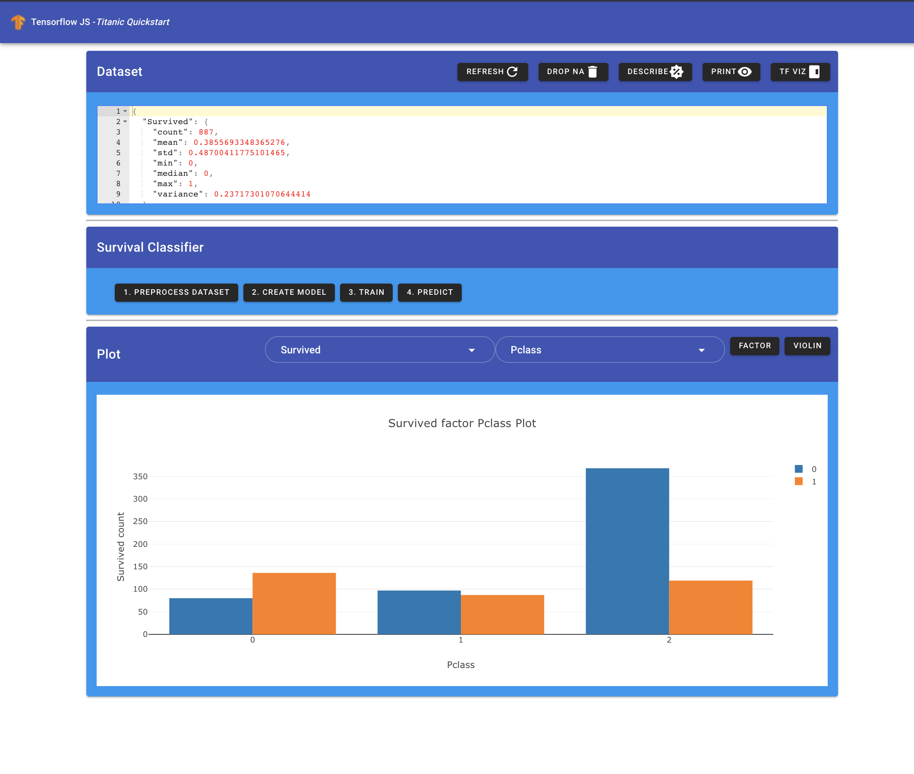
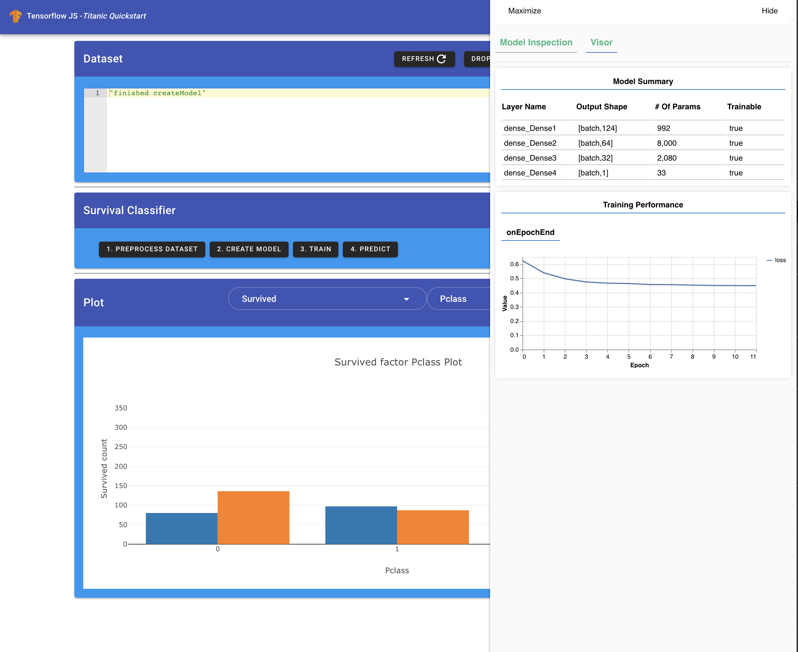

# [T3chFlicks](https://t3chflicks.org) - Tensorflow JS - Titanic Quickstart
> Learn how to use Tensorflow JS to model Titanic dataset

This project was largely from https://danfo.jsdata.org/examples/titanic-survival-prediction-using-danfo.js-and-tensorflow.js.

### Aims:
* Learn tensorflow JS
* Learn danfo JS
* Learn plotly JS
* Learn tensorflow viz

## ScreenShots:
Look at data:

Train a model:

Visualise performance:


---

## Project setup
```
yarn install
```

### Compiles and hot-reloads for development
```
yarn serve
```

### Compiles and minifies for production
```
yarn build
```

### Lints and fixes files
```
yarn lint
```

### Customize configuration
See [Configuration Reference](https://cli.vuejs.org/config/).

---

This project was created by [T3chFlicks](https://t3chflicks.org) - A tech focused education and services company.

---